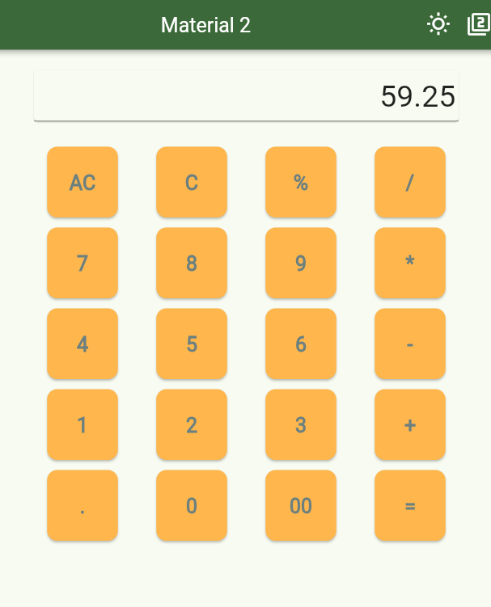
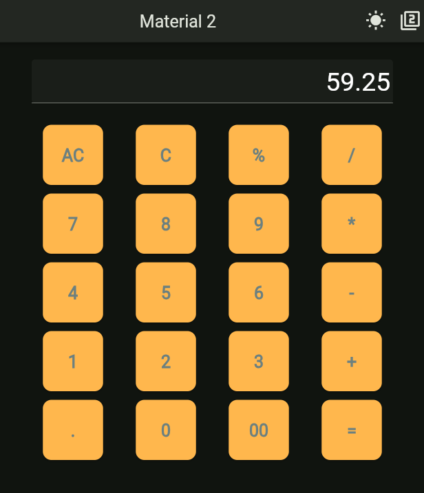

# CalcUpeuX

**CalcUpeuX** es una aplicación de calculadora versátil construida con Flutter. Este proyecto muestra una interfaz de usuario simple e intuitiva para realizar operaciones matemáticas básicas como suma, resta, multiplicación, división, y más. Además, incluye un cambio entre modo claro y oscuro, y la opción de alternar entre Material 2 y Material 3 en el diseño.

## Características

- Realiza operaciones aritméticas básicas: suma, resta, multiplicación, división y módulo.
- Alterna entre modo claro y oscuro.
- Cambia entre los estilos de diseño Material 2 y Material 3.
- Diseño adaptable y botones interactivos en la interfaz de usuario.

## Capturas de Pantalla

*Incluye capturas de pantalla o GIFs que muestren la interfaz y funcionalidad de la aplicación.*

## Tecnologías

Esta aplicación está desarrollada utilizando:
- **Flutter**: Un kit de herramientas de UI para construir aplicaciones nativas compiladas para móviles, web y escritorio desde un solo código base.
- **Dart**: El lenguaje de programación utilizado en aplicaciones Flutter.
- **Material Design**: El sistema de diseño de Google para construir productos bonitos y funcionales.

## Configuración e Instalación

Para ejecutar este proyecto localmente, sigue estos pasos:

1. Clona este repositorio:
   ```bash
   git clone https://github.com/tuusuario/calc_upeux.git
   ```

2. Navega al directorio del proyecto:
   ```bash
   cd calc_upeux
   ```

3. Instala las dependencias:
   ```bash
   flutter pub get
   ```


Asegúrate de tener Flutter y Dart instalados en tu máquina. Puedes seguir la documentación oficial para las instrucciones de instalación.

## Estructura del Proyecto
```graphql
Copiar código
calc_upeux/
│
├── lib/
│   ├── main.dart                # Punto de entrada de la aplicación
│   ├── components/
│   │   ├── CustomAppBar.dart     # Widget personalizado de la barra de navegación con cambio de tema
│   │   └── CalcButton.dart       # Widget de botón para la interfaz de usuario de la calculadora
│   ├── theme/
│   │   └── AppTheme.dart         # Configuraciones de tema y diseño Material de la app
│   └── utils/
│       └── calculation_logic.dart # Lógica para realizar operaciones de la calculadora
│
├── pubspec.yaml                  # Metadatos del proyecto y dependencias
└── README.md                     # Archivo README del proyecto
```
## Uso

Una vez que la aplicación esté en ejecución, puedes:

- Utilizar los botones para realizar operaciones aritméticas básicas.
- Alternar entre el modo claro y oscuro haciendo clic en el icono del sol.
- Cambiar entre los diseños de Material 2 y Material 3 usando el botón correspondiente.


## Resultados


